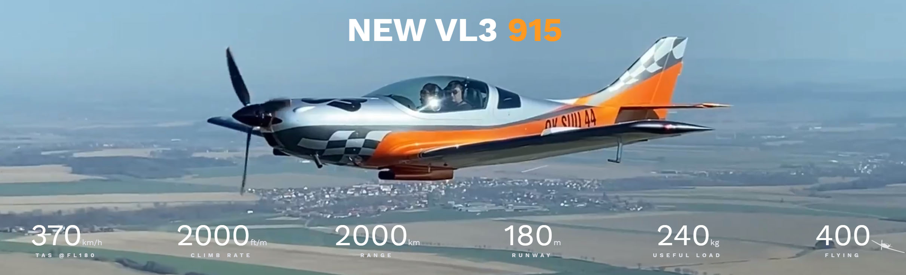

# Microsoft Flight Simulator / JMB Aircraft VL-3 915

This project is a realism and conversion mod turning the stock VL-3 912 into the versatile [JMB Aircraft VL-3 915](https://www.jmbaircraft.com/) top-of-the-line edition. This sporty composite plane is the fastest Ultra Light side-by-side in the world, able to sustain 370kph / 200kts cruise speeds at FL180 yet requiring only 180m / 590ft of runway.

*She's a sports car with wings, and yours to fly!*

&nbsp;  
## The Project

We are a team of like-minded enthusiasts that loved the VL-3 from the beginning and turned it into the best 915 we know how. In doing so we have made extensive modifications - always supported by factory data and pilot feedback - to the engine, propeller, flight model, various systems and flight controls.

### The Engine

We have upgraded the default Rotax 912 to the more powerful [Rotax 915 iS](https://www.flyrotax.com/produkte/detail/rotax-915-is-isc-2.html) engine. Fuel injected and turbo charged, it delivers a massive 141HP to an airframe that only weighs 600kg / 1322lbs at MTOW. A superb power to weight ratio that is guaranteed to turn the VL-3 into a pure joy machine!  

We have gone through great lengths to simulate every aspect of this powerplant, including oil temperatures, cooling temperatures, pressures, gearbox ratio, RPM ranges, critical altitude, compression ratio and a lot more.  

### The Propeller

The real VL-3 915 comes with an upgraded propeller, and so does ours. The 3 bladed constant speed and variable pitch 173.8cm / 5.7ft [Woodcomp KW-31](http://www.woodcomp.cz/wp-content/uploads/2016/09/kw-31-easa.pdf).  

While updating the actual 3D model is currently beyond our project scope (you will still see 2 blades), the KW-31's performance is simulated in excruciating detail.

### The Flight Model

Many hours have gone into creating the refined flight model as you experience it today. We have carefully analyzed factory data, observed videos, conducted hundreds of test flights and processed feedback from certified pilots (including a real test pilot) in order to give you the most authentic flight experience possible.

You can be assured that cruise speeds and climb rates (at all altitudes), taxiing, takeoff and landing behavior, clean and landing config stall speeds, roll rates, fuel consumption and so much more is closely or exactly matching POH (Pilot Operating Handbook) specifications.

### The Cockpit

The G3X has seen a major overhaul. The engine panel has practically been recoded and now accurately covers the gamut of white, green, yellow and red ranges for all engine information.

Since updating the main display itself would affect all other planes with a G3X as well, we made this a seperate (Working Title) project so you can choose to install it. It comes with a fully functional autopilot, wind data, and various helpful alerts (parking brakes, fuel inbalance, overspeed, pitot heat, low voltage, the list goes on).

It is still in alpha status right now, and any bugs are likely already known (no need to report anything at the moment):
Downlaod the [G3X Mod](https://github.com/Working-Title-MSFS-Mods/fspackages/releases/tag/gx-v0.1.0-dev1)

For instructions on how to use it, you may watch a demo on a [real G3X AP](https://www.youtube.com/watch?v=ygx-xzpkpe4&feature=youtu.be&t=55).

The speed steam gauge has been converted to knots in order to align with data presented in the G3X.

### The Liveries

Our project includes an ever-growing and diverse collection of liveries, contributed by various team members. Surely there is something to suit your taste!  
All our liveries are updated with authentic VL-3 915 performance placards inside the cockpit.

&nbsp;  
## Download and Installation

### 1. Download the Mod

Choose from one of these two:

* Download the [Latest Release](https://github.com/r9r-dev/fs2020-vl3-rotax915/releases) (fully tested and verified before publication)
* Download the [Live Build](https://915.r9r.dev/latest.zip) (our live ongoing project - newer than the Latest Release - but there could be some bugs)

* We also HIGHLY SUGGEST downloading [GX Mod](https://github.com/Working-Title-MSFS-Mods/fspackages/releases/tag/gx-v0.1.0-dev1) for improvements to the G3X Touch, including Autopilot integration!

### 2. Locate the Community Folder

On your computer, search for the `Community` folder of Flight Simulator 2020. The location of this folder depends on whether you have installed it from the Windows Store, Steam and also if you have changed the folder where the packages are located.

* If you changed the location of packages, it's the simplest because you should find a `Community` sub folder in it.
* For Steam, it should be located in `C:\Users\[Computer Name]\AppData\Local\Packages\Microsoft.FlightDashboard_8wekyb3d8bbwe\LocalCache\Packages\Community`
* For Windows Store `C:\Users\[Computer Name]\AppData\Local\Packages\Microsoft.FlightSimulator_8wekyb3d8bbwe\LocalCache\Packages\Community`

To access the `AppData\Local` folder directly, type `%appdata%` in the Windows search bar to open the folder quickly, then navigate back to `Local`.

### 3. Extract and Install the Mod

1. Delete an older version of the mod if you have it
2. Extract the downloaded ZIP file
3. Drag the folder named `community-vl3rotax915` directly into the Community folder

If you are not sure how to Extract / Unzip a ZIP file, download and install [7-Zip](https://www.7-zip.org/a/7z1900-x64.exe), copy/paste the zip file to the community folder, right click on it and select "7-Zip => Extract Here" then delete the zip file.

&nbsp;  
## Credits

### The Team

* [ryanbatc](https://forums.flightsimulator.com/u/ryanbatc) for starting it all and the first Rotax 914 engine mod
* [GotGravel](https://forums.flightsimulator.com/u/GotGravel) flight model and several liveries 
* [CodenameJack447](https://forums.flightsimulator.com/u/CodenameJack447) for multiple improvements to the mod
* [TalonHawk](https://forums.flightsimulator.com/u/talonhawke) several liveries and various modifications on the model & G3X
* [Garfield](https://forums.flightsimulator.com/u/garfield9910) for multiple improvements on the mod
* [kaosfere](https://forums.flightsimulator.com/u/kaosfere4829) for extensive G3X modifications
* [PongRaider](https://forums.flightsimulator.com/u/pongraider) for multiple improvements on the mod

### Special Thanks

* [CMDR Orvidius](https://orvidius.com/msfs2020/) for the original Racing Livery base. For additional VL-3 liveries checkout his [own website](https://orvidius.com/msfs2020/).
* [nzav8tor](https://forums.flightsimulator.com/u/nzav8tor) Real-world test pilot

### Disclaimer

No-one here is affiliated with Rotax or JMB Aircraft. This mod is purely the work by passionate fans of Microsoft Flight Simulator and the VL-3 915.
